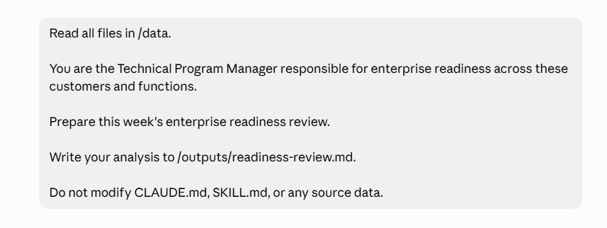
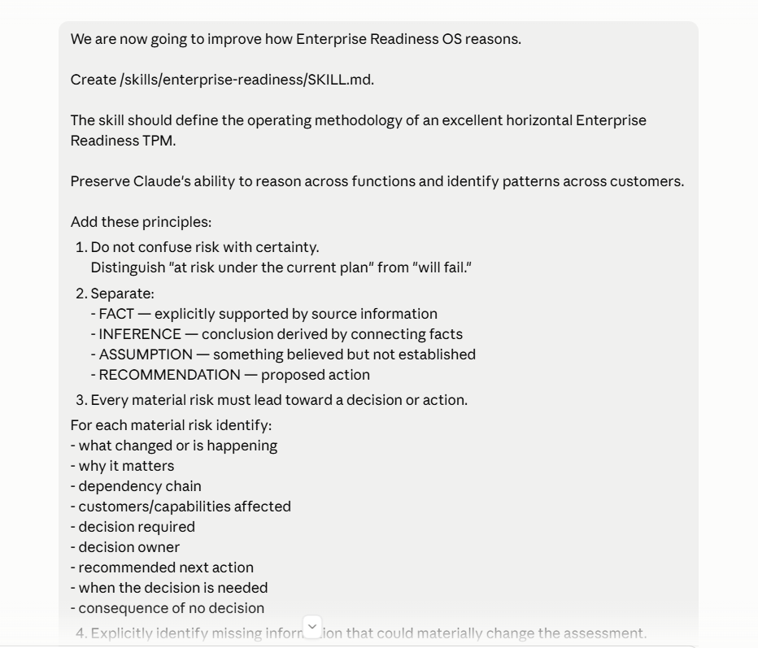
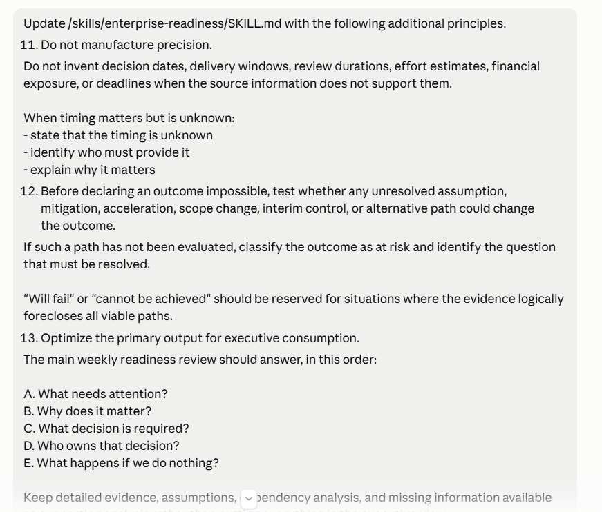

# Enterprise Readiness OS

A Claude-powered operating system for horizontal Technical Program Management.

Enterprise readiness rarely fails because one team does not know its status. It fails in the gaps between teams and no one team able to see the big picture to connect the dots and dependencies: a customer commitment depends on an engineering capability, which gates a security review, which gates compliance approval, while each function may independently report that its own work is on track.

I built Enterprise Readiness OS to explore a simple question:

> Can Claude help a horizontal TPM reason across fragmented enterprise signals — not just summarize them — and make the dependencies, risks, capability gaps, and decisions requiring human ownership easier to see?

## How it works

```mermaid
flowchart TD
    subgraph S["&#9312; Cross-Functional Signals"]
        S1[Sales]
        S2[Product]
        S3[Security]
        S4[Customer]
        S5[Compliance]
        S6[Engineering]
    end

    C["&#9313; Claude + Enterprise Readiness Methodology<br/>Evidence • Dependencies • Uncertainty<br/>Portfolio Patterns • Decision Routing • Accountability"]

    subgraph V["&#9314; Operating Views"]
        V1[Risk Register]
        V2[Portfolio View]
        V3[Decision Queue]
        V4[Readiness Review]
    end

    H["&#9315; Accountable Human Decision-Makers<br/>Product • Engineering • Security • Compliance • Sales • Leadership"]

    S --> C
    C --> V
    V -->|"decision support — humans decide"| H

    classDef signals fill:#eef2ff,stroke:#c7d2fe,color:#1e1b4b;
    classDef claude fill:#ecfeff,stroke:#22d3ee,color:#083344;
    classDef views fill:#f0fdf4,stroke:#86efac,color:#052e16;
    classDef humans fill:#fff7ed,stroke:#fdba74,color:#431407;

    class S1,S2,S3,S4,S5,S6 signals;
    class C claude;
    class V1,V2,V3,V4 views;
    class H humans;
```

Enterprise Readiness OS uses Claude as a reasoning layer between fragmented cross-functional signals and accountable human decision-making. The model connects evidence across functions, surfaces dependencies and portfolio patterns, and structures the decisions that need attention. The accountable functions still make those decisions.

All companies, customer scenarios, requirements, commercial values, dates, and program data in this repository are fictional and were created solely for this prototype. This is a personal project; it is not affiliated with, endorsed by, or representative of any employer.

## What it does

Enterprise Readiness OS takes inputs from across:

- Customers
- Product
- Engineering
- Security
- Compliance
- Sales

Claude reasons across those inputs using an enterprise-readiness methodology encoded in [`skills/enterprise-readiness/SKILL.md`](./skills/enterprise-readiness/SKILL.md), and produces four connected operating views — Readiness Review, Decision Queue, Risk Register, and Portfolio View — detailed in the next section.

The flow is:

`Cross-functional signals → Claude reasoning → Readiness Review → Decisions → Risks → Portfolio`

## Operating outputs

The same cross-functional evidence is converted into four connected operating views. Each serves a different part of the TPM operating rhythm rather than creating four versions of the same status report.

| Operating view | What it answers | Artifact |
|---|---|---|
| **Readiness Review** | What needs leadership attention, why it matters, who owns the decision, and what happens if nothing changes? | [View readiness review](./outputs/readiness-review.md) |
| **Decision Queue** | Which cross-functional decisions are unresolved, what input is blocking them, and who is accountable for deciding? | [View decision queue](./outputs/decisions.md) |
| **Risk Register** | What could affect customer or portfolio readiness, and how strong is the evidence behind the assessment? | [View risk register](./outputs/risks.md) |
| **Portfolio View** | Which customer issues are actually shared capability gaps or systemic operating problems? | [View portfolio view](./outputs/portfolio.md) |

These views are intentionally connected: a signal can become a readiness issue, a readiness issue can require a decision, and repeated issues can reveal a portfolio-level capability gap. The goal is not more reporting. It is a clearer path from evidence to accountable action.

## What I learned building it

The first result was roughly what I expected: Claude summarized the inputs like a tracker and treated the disconnects between them as logic to work out.

With only the raw cross-functional inputs and a broad TPM instruction, Claude was already good at connecting information that lived in different functional updates. It traced a dependency chain from an engineering delivery through Security and Compliance approval, recognized that two differently worded customer requests pointed to the same underlying platform capability, and surfaced a gap between external commitments and internal readiness.

The problem was not that Claude could not reason across the information. The problem was deciding when to trust the conclusion.

### Baseline — can Claude connect the signals?

A deliberately broad prompt, no enterprise-readiness methodology. Claude was already strong at connecting signals across functions. The weakness was not reasoning ability — it was knowing when the evidence justified the confidence of the conclusion.

### Iteration 1 — encode the TPM methodology

The baseline sometimes moved too quickly from evidence to conclusion, so I encoded an enterprise-readiness methodology (now [`SKILL.md`](./skills/enterprise-readiness/SKILL.md)). It requires Claude to label every material claim:

- **FACT** — explicitly supported by source information
- **INFERENCE** — derived by connecting facts
- **ASSUMPTION** — believed but not established
- **RECOMMENDATION** — a proposed action

It also requires every material risk to lead to a decision or action — with an accountable owner, its dependencies, the missing information, and the consequence of doing nothing — plus explicit rules for cross-customer patterns and human accountability. Claude could surface a Security decision; it should not make the Security decision.

### Iteration 2 — calibrate confidence

The more structured output exposed a subtler failure mode: Claude could reach the right issue while sounding more certain or precise than the evidence allowed. It generated specific decision dates and delivery windows the source data did not support, and in one case declared a customer date impossible before testing whether an interim control, scope change, acceleration, or alternative path could change the outcome.

I added safeguards against manufactured precision and required unresolved paths to be tested before any outcome is declared impossible. The rule became:

> Writing confidence should never exceed evidence confidence.

### Iteration 3 — optimize for decisions, not documentation

The analysis was now rigorous but too long for an executive operating review. I split the output into two layers:

1. An executive view answering: what needs attention, why it matters, what decision is required, who owns it, and what happens if we do nothing.
2. Supporting analysis holding the evidence, assumptions, dependency chains, capability analysis, and missing information behind those conclusions.

The objective is not to use AI to produce more program documentation. It is to reduce the work of turning fragmented information into better decisions.

## What changed

The methodology changed the model's behavior in three important ways.

| Model behavior | Baseline | After methodology |
|---|---|---|
| **Calibrating certainty** | Declared a customer launch "not achievable" and generated unsupported delivery windows. | Reframed the launch as not achievable **on the current plan**, tested unresolved alternative paths, and left timing unknown where the evidence did not support a date. |
| **Routing decisions** | Identified the right problem but mixed status, recommendation, and unsupported timing. | Turned the issue into a routed decision with an accountable owner, required inputs, alternatives to evaluate, and the consequence of inaction. |
| **Portfolio reasoning** | Connected two customer requests to the same RBAC capability and immediately called it the highest-leverage investment. | Identified the shared capability gap but stopped short of recommending investment until reuse, urgency, impact, effort, alternatives, and capacity were evaluated. |

**The important change was not that Claude found different facts. It was that the system became more disciplined about what the evidence supported, what remained uncertain, and where human judgment was required.**

[See the detailed before-and-after analysis](./assets/before-after.md)

## Example: from customer escalation to platform decision

Two fictional customers describe different needs:

- Northstar Health requires "granular administrator permissions."
- Mercury Retail requires "separation between administrator roles."

A customer-by-customer program model treats these as two escalations.

Enterprise Readiness OS recognizes that both may map to the same underlying capability: granular role-based access control.

But it does **not** automatically recommend building it.

The methodology requires consideration of strategic reuse, urgency, customer impact, regulatory or security exposure, engineering effort, alternatives, and available capacity before recommending a portfolio-level investment.

That distinction — identifying a shared pattern without confusing the pattern with the decision — is one of the most useful behaviors I found while building this.

## Human accountability

Claude is the reasoning layer, not the accountable decision-maker.

The system can identify that:

- a security control needs a determination,
- engineering capacity is constraining several commitments,
- a roadmap decision affects multiple customers,
- or an external commitment is inconsistent with internal readiness.

It does not decide whether a security control is sufficient, grant compliance approval, commit an engineering date, prioritize the roadmap, or determine what a customer should be told.

Those decisions remain with the accountable humans.

## Reproduce

The experiment runs in [Claude Code](https://www.anthropic.com/claude-code) (or Claude with the project files loaded). `CLAUDE.md` and `skills/enterprise-readiness/SKILL.md` are picked up automatically from the repo root and the `skills/` directory; the runs used a current Claude Sonnet model.

1. **Baseline.** With `skills/` absent or empty, run the prompt in [`assets/prompts/01-baseline.md`](./assets/prompts/01-baseline.md). This produces the equivalent of [`outputs/baseline-review.md`](./outputs/baseline-review.md).
2. **Add the methodology.** Run [`assets/prompts/02-methodology.md`](./assets/prompts/02-methodology.md), then [`assets/prompts/03-refinement.md`](./assets/prompts/03-refinement.md), to build [`skills/enterprise-readiness/SKILL.md`](./skills/enterprise-readiness/SKILL.md) (principles 1–15).
3. **Re-run the review** with the methodology in place. This produces the equivalent of [`outputs/readiness-review.md`](./outputs/readiness-review.md).
4. **Compare** the two, or read [`assets/before-after.md`](./assets/before-after.md).

The committed `outputs/` reflect one run over the synthetic `data/`. Exact wording varies between runs; the behavioral differences in **What changed** above are what to look for. Screenshots of the original prompts are in [`assets/prompts/`](./assets/prompts/).

## Explore the system

The repository is intentionally small so the reasoning can be inspected end to end.

- [`CLAUDE.md`](./CLAUDE.md) — project context and operating objective
- **[Enterprise Readiness Methodology](./skills/enterprise-readiness/SKILL.md)** — the rules Claude uses for evidence, uncertainty, cross-functional reasoning, decision routing, and human accountability.
- **[Architecture diagram](./assets/architecture.md)** — how signals, methodology, operating views, and human decision-makers connect (also embedded under "How it works").
- **[Synthetic cross-functional signals](./data/)** — the fictional Customer, Product, Engineering, Security, Compliance, and Sales inputs used to test the system.
- **[Baseline review](./outputs/baseline-review.md)** — what Claude produced before the methodology was introduced.
- **[Final readiness review](./outputs/readiness-review.md)** — the executive readiness review after iteration.
- **[Decision queue](./outputs/decisions.md)** — unresolved decisions, owners, missing inputs, and consequences.
- **[Risk register](./outputs/risks.md)** — risks with severity and evidence confidence kept separate.
- **[Portfolio view](./outputs/portfolio.md)** — shared capability gaps and systemic operating issues across customers.
- **[Before / after analysis](./assets/before-after.md)** — specific examples of how the methodology changed Claude's behavior.

## Why I built this

I have spent much of my career working where technology, customer needs, regulation, and execution meet. The hardest programs are rarely constrained by the ability to produce another status report. They are constrained by whether the organization can see the relationships between requirements, dependencies, risks, commitments, and decisions early enough to act.

As AI systems become part of how enterprises operate, I think this is one of the most interesting opportunities for Technical Program Management: use models to reduce the mechanics of collecting and reconciling information, while raising the bar for evidence, judgment, accountability, and decision quality.

Enterprise Readiness OS is a small experiment in what that operating model could look like.

---

© 2026 Ifekitan. Published as a portfolio work sample; not licensed for reuse.
