# Enterprise Readiness OS — Architecture

```mermaid
flowchart TD
    subgraph S["&#9312; Cross-Functional Signals"]
        S1[Sales]
        S2[Product]
        S3[Security]
        S4[Customer]
        S5[Compliance]
        S6[Engineering]
    end

    C["&#9313; Claude + Enterprise Readiness Methodology<br/>Evidence • Dependencies • Uncertainty<br/>Portfolio Patterns • Decision Routing • Accountability"]

    subgraph V["&#9314; Operating Views"]
        V1[Risk Register]
        V2[Portfolio View]
        V3[Decision Queue]
        V4[Readiness Review]
    end

    H["&#9315; Accountable Human Decision-Makers<br/>Product • Engineering • Security • Compliance • Sales • Leadership"]

    S --> C
    C --> V
    V -->|"decision support — humans decide"| H

    classDef signals fill:#eef2ff,stroke:#c7d2fe,color:#1e1b4b;
    classDef claude fill:#ecfeff,stroke:#22d3ee,color:#083344;
    classDef views fill:#f0fdf4,stroke:#86efac,color:#052e16;
    classDef humans fill:#fff7ed,stroke:#fdba74,color:#431407;

    class S1,S2,S3,S4,S5,S6 signals;
    class C claude;
    class V1,V2,V3,V4 views;
    class H humans;
```

**Flow:** Cross-functional signals → Claude + Enterprise Readiness methodology (`skills/enterprise-readiness/SKILL.md`) → Operating views → Accountable human decision-makers.

Claude is the reasoning layer, not the accountable decision-maker. It reconciles fragmented signals into four operating views so the accountable humans — Product, Engineering, Security, Compliance, Sales, and Leadership — can decide faster and on better evidence. It does not grant approvals, commit dates, prioritize the roadmap, or determine what a customer is told. Humans decide.
